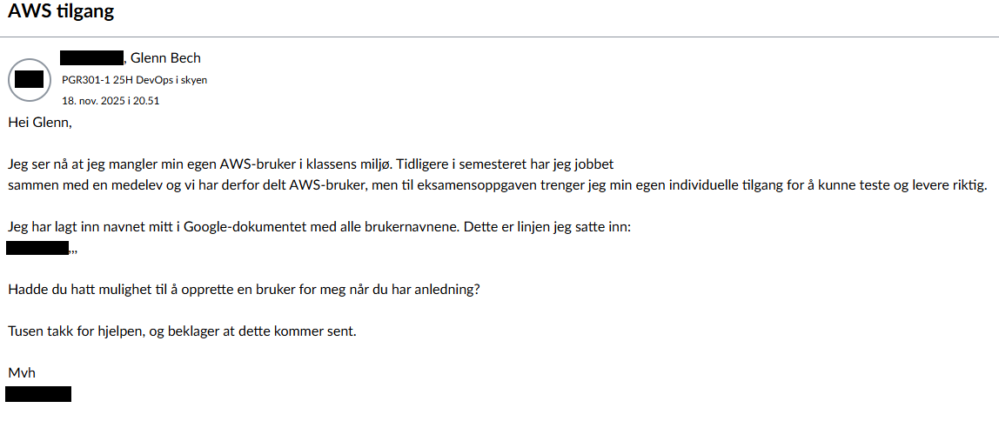

# README_SVAR — PGR301 EKSAMEN 2025 (AiAlpha)

---

# 0. Kort status

Denne README forklarer hva som er implementert, hvordan sensor kan verifisere løsningen lokalt og i GitHub Actions, hvilke begrensninger som finnes (manglende AWS-tilgang) og gir tekniske kommandoer for å gjenskape testene.

Arbeidet i repoet inkluderer:

* Terraform for S3 (`infra-s3/`)
* Terraform for CloudWatch (`infra-cloudwatch/`)
* SAM-applikasjon (`sam-comprehend/`) (bygget og lokalt testet)
* Containerisert Spring Boot-app (`sentiment-docker/`) med smoke-test
* GitHub Actions workflows for Terraform, SAM og Docker
* Observability-artefakter og push-metric test-scripts

**Merk:** Alle AWS-deploys er *ikke* kjørt mot ekte AWS fordi jeg mangler gyldige AWS-credentials. Alt er testet lokalt så langt som mulig (Docker, SAM local, Terraform plan, Maven build).

---

# 1. Dokumentasjon av manglende AWS-tilgang

Jeg oppdaget under eksamen at jeg manglet min egen AWS-bruker i klassen sitt AWS-miljø. Tidligere i semesteret jobbet jeg sammen med en medelev, og vi delte derfor en AWS-bruker på øvinger. Til eksamen kreves individuell bruker.

## 1.1. Henvendelse til faglærer

Jeg sendte melding til lærer 18. november hvor jeg forklarte situasjonen og ba om AWS tilgang.  
Skjermbilde av meldingen:



Jeg mottok ikke respons før innleveringsfristen.

---

## 1.2. Google-dokumentet for AWS-brukere

Studentene skulle legge inn navnet sitt i et Google-dokument, der et script oppretter AWS-brukere automatisk.
**OBS:** Dokumentet inneholder ekte studentnavn fra klassen inkludert mitt.  
Jeg gjengir derfor *kun formatet* navnene står i:

~~~
Fornavn.Etternavn,,,
~~~

Her er selve Google-dokumentet (med navn):
https://docs.google.com/document/d/1I39mO8-ERVxSEOc7e-ee1Ym_YublTrqDRqwQSj-2ccc/


Redigeringshistorikken i dokumentet viser at jeg la inn linjen **18. november kl. 20:18**.

---

## 1.3. Konsekvens og tiltak

Siden AWS-brukeren min ikke ble opprettet, kunne jeg ikke:

- logge inn i AWS-konsollen  
- kjøre Terraform apply mot AWS  
- kjøre `sam deploy`  
- teste Lambda, API Gateway, S3 eller CloudWatch i AWS  

**Derfor er alle eksamensoppgaver løst lokalt**, basert på:

- SAM local  
- Terraform init/validate/fmt  
- Docker build & run
- GitHub Actions for alle relevante deler  
- Lokale mocks der AWS vanligvis ville vært brukt  

Dokumentasjonen over er inkludert slik at eksamenen kan vurderes korrekt.

---

# 2. Hvordan sensor reproduserer og verifiserer løsningen

Dette avsnittet viser eksakte kommandoer (kopier/past) for å kjøre alt lokalt uten AWS, og hva som må gjøres for å kjøre mot ekte AWS.

## 2.1. Forutsetninger (lokalt)

* Docker og Docker daemon kjører
* Git
* Python 3.11 (for SAM build/test container)
* Maven (for lokal mvn build) — valgfritt hvis du bruker workflow

### 2.2. Lokale verifikasjonskommandoer

### Terraform (Sjekk fmt, validate, plan) — kjør lokalt i Docker (ingen creds nødvendig for `plan` med skips)

```bash
# infra-s3
docker run --rm -v "$PWD":/repo -w /repo/infra-s3 hashicorp/terraform:1.5.7 init -backend=false
docker run --rm -e AWS_ACCESS_KEY_ID=LOCALFAKEKEY -e AWS_SECRET_ACCESS_KEY=LOCALFAKESECRET -e AWS_DEFAULT_REGION=eu-west-1 -v "$PWD":/repo -w /repo/infra-s3 hashicorp/terraform:1.5.7 fmt -check
docker run --rm -e AWS_ACCESS_KEY_ID=LOCALFAKEKEY -e AWS_SECRET_ACCESS_KEY=LOCALFAKESECRET -e AWS_DEFAULT_REGION=eu-west-1 -v "$PWD":/repo -w /repo/infra-s3 hashicorp/terraform:1.5.7 validate
docker run --rm -e AWS_ACCESS_KEY_ID=LOCALFAKEKEY -e AWS_SECRET_ACCESS_KEY=LOCALFAKESECRET -e AWS_DEFAULT_REGION=eu-west-1 -v "$PWD":/repo -w /repo/infra-s3 hashicorp/terraform:1.5.7 plan -out=tfplan

# infra-cloudwatch (same pattern)
```

### SAM (build + local invoke using official SAM build image)

```bash
# Build with SAM builder (runs in Docker image provided by repo)
docker run --rm -v "$PWD":/work -w /work public.ecr.aws/sam/build-python3.11 bash -lc "cd sam-comprehend && sam build"

# Quick sanity check (inspect built package)
ls sam-comprehend/.aws-sam/build
```

### Docker + Spring Boot (build & smoke-test)

```bash
cd sentiment-docker
mvn -B -DskipTests package        # build fat jar
cd ..
docker build -t aialpha-sentiment:local sentiment-docker
# disable CloudWatch pushes locally if you don't have creds
MANAGEMENT_METRICS_EXPORT_CLOUDWATCH_ENABLED=false ./sentiment-docker/run_smoketest.sh
# or run container manually:
MANAGEMENT_METRICS_EXPORT_CLOUDWATCH_ENABLED=false docker run --rm -p 8080:8080 -e MANAGEMENT_METRICS_EXPORT_CLOUDWATCH_ENABLED=false --name aialpha-sentiment-local aialpha-sentiment:local
curl -sS http://127.0.0.1:8080/actuator/health
```

**Resultat jeg fikk lokalt:** container starter, `/actuator/health` returnerer `{ "status": "UP" }`.

---

# 3. GitHub Actions — hva kjører og hvordan aktivere full deploy

**Link til vellykket Docker-workflow fra repoet:**
https://github.com/Benhe10/pgr301-eksamen-Benhe10/actions/runs/19556982604/job/56001334334

## Hvilke workflows finnes i repoet

* `.github/workflows/terraform-s3.yml` — kjører fmt/validate/plan; apply på `main` (krever GitHub secrets med AWS creds)
* `.github/workflows/sam-ci.yml` og `.github/workflows/sam-deploy.yml` — validerer og bygger SAM lokalt; deploy workflow må ha AWS-secrets
* `.github/workflows/docker-build.yml` — bygger jar, bygger Docker-image, kjører smoke-test; pusher også til GHCR hvis `CR_PAT` er tilstede

## Secrets og hva som må legges til i for full deploy

For å kjøre **deploy**-trinn (terraform apply / sam deploy / push container) må sensor legge inn følgende repository secrets i sitt fork:

* `AWS_ACCESS_KEY_ID` — AWS bruker med tilstrekkige rettigheter
* `AWS_SECRET_ACCESS_KEY`
* `AWS_REGION` (f.eks. `eu-west-1`)
* `S3_DEPLOY_BUCKET` (bucket for SAM deploy artifacts / package)
* `DOCKER_USERNAME` og `DOCKER_PASSWORD` (eller `CR_PAT` for GHCR)

Når secrets er lagt til i fork, vil `apply`-jobbene kunne kjøre. Du bør også sørge for at S3-bucket for backend-state (`pgr301-terraform-state`) finnes eller at backend er konfigurert som ønsket.

**For SNS e-post-subscription:** Sensor må bruke en e-post som kan bekrefte subscription ved mottak av bekreftelses-e-post.

---

# 4. Kort teknisk gjennomgang per oppgave

**Oppgave 1 (Terraform S3)**: Kode ligger i `infra-s3/` med variabler, lifecycle rule for `midlertidig/` og outputs. `plan` er verifisert lokalt.

**Oppgave 2 (SAM)**: `sam-comprehend/` template er oppdatert til å ta `S3BucketName` som parameter. `sam build` kjørt lokalt i container. Deploy ikke kjørt pga manglende creds.

**Oppgave 3 (Docker)**: `sentiment-docker/` Maven-svarer og Dockerfile (multi-stage) finnes. Smoke-test script verifiserer at service starter og actuator/health svarer. Workflow bygger og kjører smoke-test i Actions. 
Tagging-strategi:
Jeg publiserer containeren med taggene `latest` og commit SHA (`sha-<commit>`). 
Dette gir en stabil ‘latest’ for bruk/testing og en unik SHA som gir sporbarhet i CI/CD.

**Oppgave 4 (Observability)**: `infra-cloudwatch/` inneholder Terraform som lager dashboard, alarm og SNS topic. Lokale tests kjøres med terraform plan (skippper credentials). Appen kan publisere metrics — men uten AWS-creds logger appen credential-feil (forventet). I test-run har jeg deaktivert CloudWatch-publishing med env var `MANAGEMENT_METRICS_EXPORT_CLOUDWATCH_ENABLED=false`.

---

# 5. Oppgave 5 — Drøfting: KI-assistert systemutvikling og DevOps-prinsipper

**Innledning**
KI-assisterte verktøy som Copilot og store språkmodeller kan fundamentalt endre hvordan vi utvikler og leverer programvare. De påvirker flyt, feedback og kontinuerlig læring — kjerneprinsippene i DevOps. Her drøfter jeg fordeler og utfordringer, med eksempler fra arbeidet i denne eksamenen.

**Flyt (Flow)**
KI kan akselerere utviklingsflyten ved å automatisere gjentakende oppgaver: generere boilerplate, skrive tester og hjelpe med feilsøking. I praksis kan dette redusere tiden fra idé til fungerende prototype — vi opplevde dette ved at ChatGPT/auto-verktøyet bidro til forslag til Terraform- og workflow-snippets som jeg raskt kunne teste lokalt. Samtidig kan KI skape nye flaskehalser: dårlig generert kode kan føre til tidskrevende debugging, og økt avhengighet av verktøyet kan gjøre at teamet mister dypere forståelse. I et CI/CD-regime må derfor generert kode underlegges ekstra kontroller (statisk analyse, peer review, og automatiserte tester) for å unngå uforutsette feil i produksjon.

**Feedback**
Når deler av koden er AI-generert, blir raske og pålitelige feedback-loops enda viktigere. Automatiserte tester (unit, integration), overvåkning og metrikker må fange både funksjonelle feil og driftsproblemer. I dette prosjektet understreker observability-delen (CloudWatch-metrikker og alarms) hvordan feedback gjør det mulig å oppdage at CloudWatch-push mislykkes uten credentials. KI kan hjelpe med å skrive testskjeletter og observability-konfig, men bygger ikke kvaliteten alene — testsuiten og produksjonsovervåkningen må være kilden til sannhet.

**Kontinuerlig læring og forbedring**
KI kan være en katalysator for læring: den gir forslag, forklarer mønstre og hjelper utviklere å lære nye biblioteker raskere. Men faren er "skill fade": Hvis teamet blindt aksepterer forslag uten å forstå dem, svekkes dyp kompetanse. Organisasjoner bør derfor kombinere KI-assistanse med pair-programming, code reviews som fokuserer på begrunnelser ("hvorfor er dette sikkert/effektivt?") og regelmessige opplæringsøkter. For eksamensarbeidet mitt har jeg brukt KI som assistent, men verifisert alle endringer lokalt og gjennom CI—det illustrerer en god praksis: bruk KI for produktivitet, men oppretthold ansvar gjennom testing og review.

**Konklusjon**
KI-assisterte verktøy øker potensielt tempoet i utvikling og forbedrer produktiviteten, men stiller krav til kvalitetssikring og kontinuerlig læring. For å utnytte KI trygt må vi styrke feedback-mekanismer (testing, observability) og sikre at teamet forstår hva verktøyene gjør. I denne eksamensoppgaven har jeg brukt KI som hjelpemiddel, men fulgt DevOps-prinsippene for å sikre pålitelig leveranse—noe jeg anbefaler som praksis i alle produksjonssystemer.

---

# 6. Feilsøking / vanlige problemer

* **Docker port conflict:** Hvis port 8080 er i bruk, fjern gamle containere: `docker ps -a` og `docker rm -f <id>`.
* **Terraform credentials errors:** For `plan` med fake creds bruk `skip_*` provider flags i provider eller sett env vars som i eksemplene ovenfor.
* **SAM deploy:** `sam deploy` trenger en deploy-bucket og credentials. Legg til `S3_DEPLOY_BUCKET` secret i workflow.